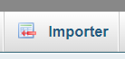

# API REST Train Filtering
# Tester en local
/!\ Bien mettre le booléen "docker" à False dans le fichier \_\_init__.py /!\

## Comment lancer le Flask
### Créer un venv et l'activer
> .../webservice> python -m venv .venv
#### Pour Windows (par CMD) :
> .../webservice> cd .venv/Scripts
> .../webservice/.venv/Scripts> activate.bat
#### Pour Linux :
> .../webservice> ./.venv/Scripts/activate

### Installer les bibliothèques python
> .../webservice/.venv/Scripts> cd ../..
> .../webservice> python.exe -m pip install --upgrade pip
> .../webservice> pip install -r requirements.txt

### Lancer l'app flask
> .../webservice> [python -m flask|flask] --app '.\REST Train Filtering\FlaskApp\app\\\_\_init__.py' run

si cela ne fonctionne pas, deplacer vous dans .\REST Train Filtering\FlaskApp\app et réaliser la commande :
> .../webservice/REST Train Filtering/FlaskApp/app> [python -m flask|flask] --app \_\_init__.py run

#### Flask disponible
> http://127.0.0.1:5000

### Lancer la base de donnée
#### Télécharger le logiciel
> [**XAMPP**](https://www.apachefriends.org/fr/download.html) (si cela n'est pas déjà fait)

Ensuite lancer les serveurs Apache et MySQL :

Rendez-vous dans le phpMyAdmin en cliquant sur le bouton :

ou par ce lien :
> http://localhost/phpmyadmin/

Créer une nouvelle base de données:

Nommez la "secf" et appuyez sur "Créer":

Et importez le fichier *secf.sql*
> ...\webservice\\"REST Train Filtering"\secf.sql

# Tester via Docker

/!\ Bien mettre le booléen "docker" à True dans le fichier \_\_init__.py /!\

### Lancer Docker
#### Télécharger le logiciel
> [**Docker**](https://www.docker.com/products/docker-desktop/) (si cela n'est pas déjà fait)

#### Créer le docker
> docker-compose up --build

#### Flask disponible 
> http://localhost:8888

#### phpMyAdmin disponible
> user et mot de passe : root 
> http://localhost:8088

# Tester les requêtes :

# API SOAP Train booking
# Tester
Pro Tips: utiliser 2 terminaux pour lancer le serveur et le client

## Préparation du SOAP
> .../webservice> cd SOAP
### Créer un venv et l'activer
> .../webservice/SOAP> python -m venv .venv
#### Pour Windows (par CMD) :
> .../webservice/SOAP> cd .venv/Scripts
> .../webservice/SOAP/.venv/Scripts> activate.bat
#### Pour Linux :
> .../webservice/SOAP> ./.venv/Scripts/activate

### Installer les bibliothèques python
> .../webservice/SOAP/.venv/Scripts> cd ../..
> .../webservice/SOAP> python.exe -m pip install --upgrade pip
> .../webservice/SOAP> pip install -r requirements.txt
## Lancer le serveur
> .../webservice/SOAP> [py|python|python3] server.py

## Lancer le client
> .../webservice/SOAP> [py|python|python3] client.py